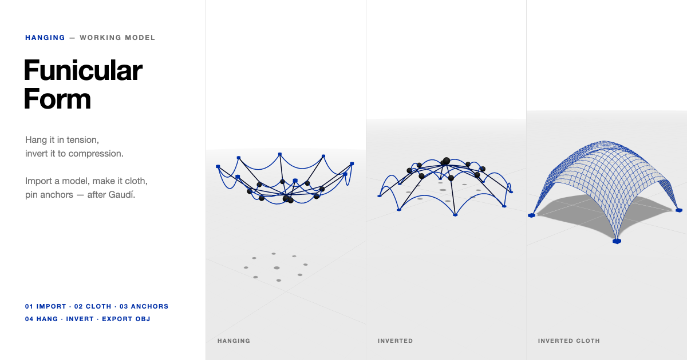

# Funicular Form — a Hanging-Model Workbench

**[Open the live model →](https://adpchrgruber.github.io/adp_adv_hanging_lab/)**



An online version of the hanging model Antoni Gaudí built for the church of the
Colònia Güell: let chains, nets and cloth hang under their own weight, and the form
they find carries load in **pure tension**. Turn it upside down and the same form
carries load in **pure compression** — the principle behind Gaudí's catenary arches,
Frei Otto's nets and Heinz Isler's shells.

Import any 3D object, turn it into cloth, pin anchor points, and let it hang.

## Use

The workflow is four steps; each unlocks the next.

1. **01 Import** — load a model (**FBX, OBJ, GLB/GLTF or STL**), **lines from a
   drawing (DWG or DXF)**, or add a primitive: chain, net, sheet, disc, sphere, torus,
   tube. Position it with the gizmo (**G** move · **R** rotate · **S** scale). Imports
   are scaled to 3 m.
   A line drawing becomes a chain network: lines, polylines (with arcs), arcs,
   circles, ellipses and splines are sampled, lines are **knotted wherever they cross
   or touch**, and the drawing's plan is laid out horizontally (its Z becomes height).
   Text, dimensions, hatches and blocks are skipped and listed.
2. **02 Cloth** — **Make cloth** re-meshes the model into particles and links.
   *Resolution* is the number of links across the longest side; dense imports are
   simplified, coarse ones subdivided. *Slack* lengthens chains, nets and imported
   lines so they can sag. **Back to model** undoes it.
3. **03 Anchors** — **Pin** (P): click particles to fix them. **Weight** (W): hang a
   sachet from a particle — on a cloth or a string — as Gaudí did with bags of lead
   shot (Shift-click removes).
   **String** (T): click two particles to hang a chain wire between them — on one
   object or across two. The wire has its own weight and sags into a catenary; its
   length is the gap times the String slider (above 100 % slack, below it pulls the
   points together). A string's own points work like any other: tie a new string to
   them, or hang a weight from them, to build wire networks. Shift-click a string to
   cut it (and anything hanging from it). **Move** (M): drag an anchor — also while it hangs. *Auto* pins corners, the
   boundary or the highest point; **Gather** slides all anchors 10 % inward, giving a
   flat sheet the slack it needs to sag.
4. **04 Hang** — **Hang** (Space) runs the simulation. **Invert** (I) flips the form
   about its anchors into the compression form. Links are drawn grey when slack and
   blue → black with rising tension.

**Export DXF** writes the current form — hanging or inverted — as a 3D DXF (metres,
Z up), the most widely read format for 3D lines: chains and strings as **3D
polylines** (each chain traced from knot to knot), cloth as a 3DFACE mesh plus its
links, anchors as points, all on separate layers. Opens in Rhino, AutoCAD,
Vectorworks, Blender and Illustrator. **Export OBJ** writes the same as an OBJ.
**Save scene** stores everything as JSON (imported models are embedded).

Keys: **Space** hang/pause · **I** invert · **P / W / T / M** tools · **F** frame all ·
**Esc** deselect · **Del** remove.

### Presets

| Preset | |
|---|---|
| Catenary | a single chain between two anchors |
| Arch family | five chains, same span, increasing slack — Gaudí's arch studies |
| Colònia Güell | ring of eight supports, chain arches and spokes, weighted with sachets |
| Four-point vault | a cloth sheet hung from its corners — inverted, an Isler-type shell |
| Dome | a disc hung from ten points on its rim |
| Hanging net | a square chain grid, Frei Otto style |
| Bag | a sphere hung from a single point |
| Tied sheets | two cloths hung from their outer corners, joined by five strings |

### Example scenes (`examples/`)

| Scene | Model | |
|---|---|---|
| `hex-shell.json` | `hexagon-panel.obj` | a hexagon hung from its six corners → six-legged shell |
| `star-canopy.json` | `star-panel.fbx` | a star hung from its five tips |
| `ring-band.json` | `ring-band.obj` | a band hung from eight points, weighted along its lower edge |
| `plan-web.json` | `plan-web.dxf` | a 2D plan in millimetres — spokes, rings, arcs, a bulged polyline, a spline — hung from its spoke ends |

The models are coarse on purpose (a handful of triangles, authored in centimetres) —
step 02 does the remeshing. Load them with **Load model…** to start from scratch.

## Model

- Position-based dynamics (XPBD, "small steps"): many substeps per frame, one
  constraint pass each, so even long chains settle quickly.
- **Links are tension-only** — a chain can't push. Their compliance is length / EA, so
  *Stretch* behaves the same at any resolution.
- **Strings** are chain wires: ~6 cm tension-only links with their own weight
  (0.04 per metre, relative to an object's weight of 1), solved in the same substep
  as the cloths, so tied objects hang as one. A 6 m wire over 5 m sags within 3 % of
  the exact catenary.
- **Bending** is a distance constraint across every interior edge (cloth) or every
  chain joint; at 0 a net is a pure funicular network.
- Each object's own weight totals 1; a *Weight* of 10 % hangs a sachet of a tenth of
  that. Anchors glide to their targets, so moving one reshapes the form live.
- **Invert** mirrors the hanging group about the highest anchor; the anchors become
  the supports on the ground.

## Run locally

Single self-contained `index.html`, no build step; [three.js](https://threejs.org)
from CDN. DWG files are read with [libredwg-web](https://github.com/mlightcad/libredwg-web)
(WebAssembly build of GNU LibreDWG, GPL-3.0), fetched from the CDN only the first
time a DWG is opened (~10 MB). DXF is parsed by the app itself. Opening the file directly works for presets; example scenes need http:

```bash
python3 -m http.server
```

Example models and scenes are generated by `tools/make_examples.py`
(Python 3, standard library only).

## Scripting

The page exposes `window.hanging` in the browser console:

```js
hanging.buildPreset('guell')
hanging.simulateFor(5)        // 5 s of simulated time, synchronously
hanging.setInverted(true)
hanging.exportOBJ()
hanging.serializeScene()
```

## Repository layout

```
index.html        the whole app (HTML, CSS, JS module)
examples/         example models (OBJ, FBX) and scene files
tools/            generator for the examples
docs/preview.png  social / README preview image
```
